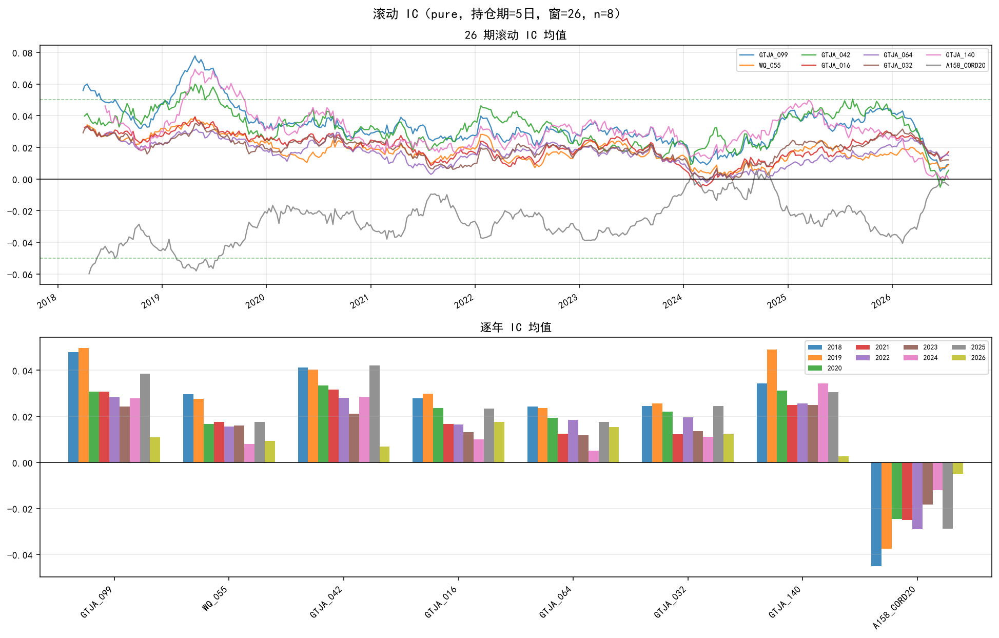
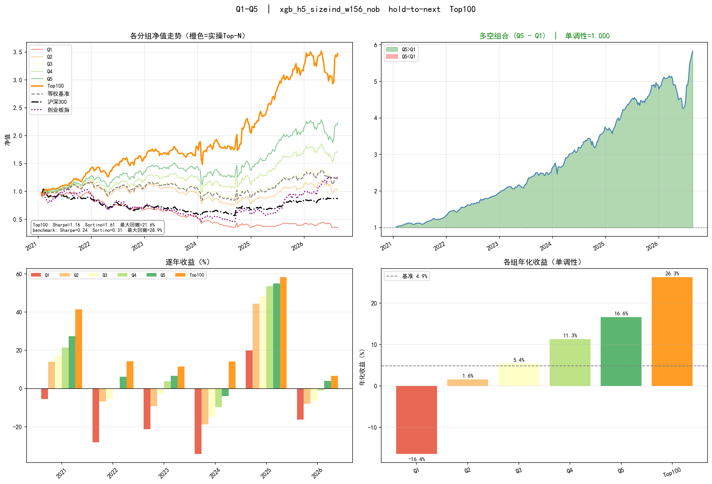
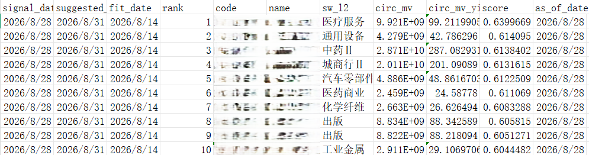

# A 股多因子量化选股框架

一个面向**研究与辅助选股**的 A 股多因子量化框架，覆盖从数据处理、因子研究到模型训练、回测和实盘候选股生成的完整流程。

```text
数据下载
   ↓
因子计算
   ↓
IC 筛选
   ↓
ML / 因子加权
   ↓
Walk-Forward 回测
   ↓
保存各期模型
   ↓
Live 加载对应模型
   ↓
输出 Top-N 候选股
```

项目的核心目标不是把“因子 + 模型 + 回测”简单拼在一起，而是尽量把量化研究中常见的数据泄漏、样本选择偏差、不可交易假设以及回测与实盘不一致等问题落实到工程流程中。

模型最终输出的是股票评分与候选排名，**不包含自动下单功能**，用于研究、策略评估以及人工二次选股。

---

## 项目结构

```text
quant_trading/
├── run.py                 # 主入口
├── ui/
│   └── app.py             # Streamlit 面板
├── config/                # 配置与因子白名单
├── data/                  # 行情、财务、行业、市值等数据
├── factors/               # 因子实现与 registry
├── models/                # Walk-Forward / dynamic / industry
├── strategies/            # linear / ML 策略调度
├── backtest/              # 分组回测与交易成本
├── research/              # IC、rolling pool、PBO 等研究模块
├── utils/                 # PIT、WLS、调仓、股票池等工具
├── live/                  # Live 模型加载与候选股生成
├── tests/
├── docs/                  # 项目文档
├── logs/                  # 实验编排
└── results/               # 本地实验结果与模型
```

---

## 流程概览

### 1. 数据下载与整理

首先从行情、财务、行业、市值、股本等数据源构建历史面板。

除了常规 OHLCV 数据外，框架还维护退市股票、ST 状态、历史行业分类以及流通市值等信息，并做 Point-in-Time（PIT，按当时可观测信息对齐）处理，使每个历史截面只使用当时能够获得的信息：财务按披露窗口可用，行业与 ST 取当时状态，股票池保留退市股，按市值圈池时用信号日当日的流通市值。

其中，行情、财务、行业、股票状态等数据都会经过统一的数据处理层，再提供给后面的因子和模型模块。

### 2. 因子计算

在整理后的历史面板上计算多种量价、基本面、风险和事件类因子。

因子通过统一 registry 注册进入研究流程。因子输出统一采用“**数值越大，预期收益越高**”的方向约定，后续 IC 分析、模型训练和回测使用同一套方向定义。

对于涨跌停等特殊交易状态，因子计算与研究样本不会简单地将股票直接删除，而是根据具体用途分别处理。

### 3. IC 筛选

计算因子的截面 Rank IC、ICIR，并结合统计检验、相关性、稳定性和可交易性等指标筛选因子。

经过筛选的因子进入配置中的白名单，只有这些因子才会参与后续 ML 训练或因子组合。

这一层的目的，是先判断因子本身是否具有稳定的横截面信息，再进入模型阶段，而不是把大量未经筛选的特征直接交给机器学习模型。



### 4. ML / 因子加权

通过线性模型、树模型或其他模型学习因子与未来收益之间的关系，也可以使用滚动 ICIR 等方法进行动态因子加权。

模型训练采用 Walk-Forward 的时间序列方式，并通过 Purging 和 Embargo 隔离存在持有期重叠的样本。

模型输出的是每个调仓日股票的预测分数，随后按照分数进行排序和分组。

### 5. 回测

回测模拟实际的信号生成与交易过程。

信号在收盘后产生，下一交易日开盘执行，并在回测中考虑涨跌停等成交限制以及交易成本。

除了组合净值，还会输出 Q1–Q5 分组表现和 Top-N 股票结果，用于观察因子的单调性、模型排序能力以及实际候选池表现。



### 6. Live 候选股

经过完整 Walk-Forward 训练后，各期模型可以保存下来。

Live 阶段不重新构造另一套预测逻辑，而是根据当前信号日期找到对应的历史模型 fold，加载该模型及其相关元数据，对最新股票池进行预测并输出 Top-N 候选股。

因此，Live 使用的特征构建、数据处理、中性化和模型调度逻辑与回测保持一致。

生产路径是全量 Walk-Forward 时加上 `--save-models`，再用 `python -m live.predict_from_wf_models` 按 fold 加载对应模型（`retrain_every=4`），与回测同口径；**不做自动下单**。备选 `python -m live.flagship_last_window` 在最近一个窗口现训再出分，口径不同，只适合快速看盘。增量更新、覆盖率与旗舰参数见 **`docs/操作手册.md`**。



---

## 因子库

项目内置了一个较为完整的多因子研究库，既包含常见的公开因子体系，也包含针对 A 股市场特征开发的自研因子。

目前涵盖：

* **Qlib 158**
* **国泰君安 191**
* **WorldQuant 101**
* **OpenSourceAP**
* 大量自研 A 股因子

自研因子覆盖传统量价、基本面之外的 A 股特色信息，例如：

* 龙虎榜
* 限售股与解禁
* 大宗交易
* 分析师预期
* 市场交易行为
* 其他事件与市场微观结构因子

这些因子统一接入框架的因子计算、IC 分析、回测和机器学习流程，因此用户可以直接在同一套研究环境中对不同来源的因子进行测试、比较和筛选。

例如，可以先从公开因子库中选择感兴趣的因子，再结合 A 股特色因子进行组合，通过统一的 IC 筛选和 Walk-Forward 回测判断其有效性，而不需要为不同因子重新编写数据处理和回测代码。

因子本身只是研究输入，最终是否进入模型由 IC 筛选和后续实验结果决定。

---

## 特色实现

### 1. 四层解耦的交易状态处理

将交易状态分别放在**因子计算、模型训练、收益标签和回测执行**四个层面处理。

这样既不会因为涨跌停、停牌等状态直接删除股票而损失截面信息，也不会在回测中假设实际无法完成的交易。

### 2. 严格的 Point-in-Time 数据治理

框架从数据层开始执行 Point-in-Time（PIT）约束，保证每个历史截面只使用当时已经可获得的信息。

财务数据按照实际披露时间进行延迟与对齐，避免将尚未公开的财务信息提前用于历史交易日。行业、ST 状态等随时间变化的数据也采用历史面板和截面 As-of 查询，而不是直接使用当前状态回溯历史。

股票池同时保留退市公司的历史数据，并使用当时的流通市值进行股票池划分，使历史样本尽量接近当时真实可见的市场环境。

这样，PIT 不再只是回测阶段的一项检查，而是贯穿数据、因子、选股和模型训练的基础约束。

### 3. 按流通市值划分研究宇宙

框架支持按照流通市值划分不同的研究宇宙，例如小微盘、中盘等，并在对应股票池内**独立进行因子筛选和模型训练**。

这与先训练一个全市场模型、再按照市值对结果进行切片不同。不同市值区间可以拥有独立的因子白名单和模型，从而更真实地检验某个因子或模型在特定市场范围内是否有效。

市值分组同样使用历史信号日的流通市值，而不是今天的市值回看历史，避免研究宇宙本身产生前视偏差。

### 4. WLS 风险残差化与 Barra 中性化

在机器学习模型训练之前，框架可以对因子特征进行截面风险残差化。

核心方法是使用**基于市值平方根加权的加权最小二乘（WLS）**，将 Size 和行业等系统性暴露从特征中剥离，再把残差化后的特征提供给模型。

这样做有两个目的：一是降低模型通过市值、行业等系统性暴露获得预测能力的可能性；二是让 ML 阶段与因子 IC 筛选阶段保持一致的风险控制口径。

框架同时实现了一套自研的 Barra 风格因子体系，可用于更完整的风险控制和中性化分析。它们主要作为**风险控制变量**存在，而不是直接作为选股信号。

具体的中性化配置和 Barra 风格因子定义见 `操作手册.md`。

### 5. 面向重叠持有期的因子筛选

对于存在重叠持有期的 IC 序列，不仅观察 IC 均值，还结合 Newey-West HAC 检验、Benjamini-Hochberg FDR、稳定性指标和因子相关性进行筛选。

目标不是寻找“历史上最高”的因子，而是尽量保留统计上可靠、具有一定持续性的因子。

### 6. 稠密因子与事件因子双轨处理

传统量价和基本面因子通常是稠密信号，而龙虎榜、解禁、高管增减持等事件因子可能在绝大多数交易日没有有效观测。

框架针对这两类因子采用不同的评价方式，并在模型端进行相应的尺度处理，避免稀疏信号仅仅因为高缺失率而被统一规则淘汰。

### 7. Purging & Embargo 防止时间泄漏

Walk-Forward 训练不仅按照时间划分数据，还会移除与验证目标存在时间重叠的训练样本，并在训练集与验证集之间设置 Embargo。

这对于多日持有期尤其重要，可以避免同一段未来收益信息以不同样本的形式同时进入训练和验证过程。

### 8. 聚类特征重要性

量化因子通常存在大量高度相关的特征。

因此，模型解释阶段会先对相关因子进行聚类，再观察组级别的重要性，从而减少同类特征之间相互分摊权重所带来的解释偏差。

相比直接查看单个特征的 Feature Importance，这种方式更适合分析“哪类信息真正驱动了模型”。

### 9. 回测与 Live 使用同一套模型架构

Live 不单独训练一套与回测不同的预测模型，而是直接加载 Walk-Forward 过程中保存的各期模型，并按照相同的重训周期进行调度。

特征构建、风格处理和模型元数据也沿用回测路径，从架构上降低“回测是一套模型、实盘又是另一套逻辑”的风险。

### 10. 严格可交易池与基准校正

研究样本与实际可交易股票池并不完全等价。

回测计算组合表现和基准时，会进一步限制到实际可交易范围，避免不可交易股票被纳入等权基准或组合后，扭曲超额收益评价。

### 11. PBO / DSR 过拟合评估

项目内置 Probability of Backtest Overfitting（PBO）和 Deflated Sharpe Ratio（DSR）等工具，用于评估大量参数搜索和策略选择之后，历史最优结果究竟有多少可能只是数据挖掘产生的。

这部分不是“防止过拟合”的保证，而是给研究结果增加一道独立的反向检查。

---

## 快速开始

安装依赖：

```bash
python -m venv .venv
```

Windows：

```bash
.venv\Scripts\activate
```

安装项目依赖：

```bash
pip install -r requirements.txt
```

准备数据后，可以先运行一个小规模样本进行冒烟测试：

```bash
python run.py --sample 100
```

完整的因子筛选：

```bash
python -m research.ic_analysis_v2 --period 5 --barra --save
```

使用筛选后的因子进行模型训练与回测：

```bash
python run.py \
  --skip-download \
  --mode xgb \
  --horizon 5 \
  --factor-config config/factor_configs.yaml
```

训练时加上 `--save-models` 后，可按 fold 出候选股（与回测同口径，不做自动下单）：

```bash
python -m live.predict_from_wf_models --as-of-date <信号日> --model-dir results/<tag>
```

可选图形界面，三个标签为回测、因子筛选和 Live 候选股。Live 页选择结果目录与信号日，按 fold 出分、展示 Top，并可检查覆盖率；增量下载须在终端完成，不在 UI 里跑：

```bash
streamlit run ui/app.py
```

更完整的数据准备、参数说明、Live 流程和日常维护方式见：

**`操作手册.md`**

---

## 注意事项

这个项目定位于**量化研究和辅助选股**，而不是自动交易系统。

回测结果依赖数据源、股票池、交易规则、成本假设以及参数选择，不应直接理解为未来收益预期。特别是因子筛选和模型调参都可能产生数据挖掘偏差，因此项目提供 PBO / DSR 等工具用于进一步检查过拟合。

项目尽可能避免幸存者偏差、前视数据和不可交易假设，但这些工程措施并不意味着策略本身不存在过拟合，也不保证样本外有效。

另外，由于行情和基本面数据来自外部数据源，不同下载时间、接口版本及数据修订都可能导致历史结果存在差异。

**本项目仅供学习与研究使用，不构成任何投资建议。证券投资存在风险，使用本项目进行投资决策所产生的结果由使用者自行承担。**

## License

[MIT License](LICENSE)
