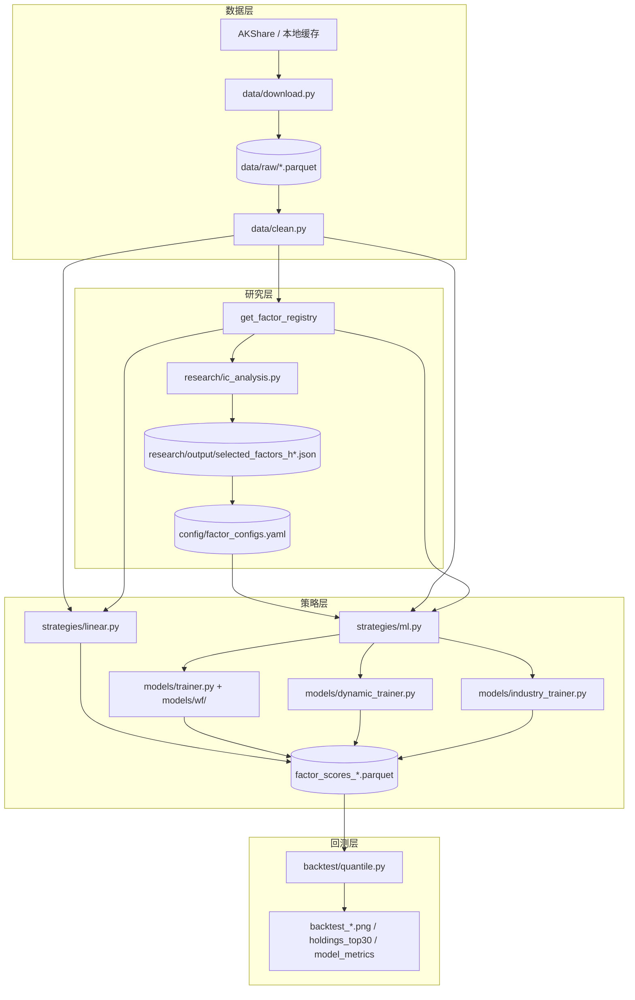

# 量化选股流水线完整说明

本文档描述当前框架下，从**原始数据下载**到**最终预测与候选股输出**的端到端流程。主入口为 `run.py`；研究筛选为 `research/ic_analysis.py`；自动化编排为 `logs/driver.py`。

> **回测说明**：历史 `backtest/engine.py` 与 `backtest/quantile_v2.py` 已合并/删除，当前**唯一**回测路径为 `backtest/quantile.py`（模块化 buy-and-hold 引擎，复用 execution/portfolio/return_engine/turnover/benchmark/report 子模块）。

---

## 目录

1. [总览与数据流](#1-总览与数据流)
2. [阶段 0：配置与路径](#2-阶段-0配置与路径)
3. [阶段 1：数据下载](#3-阶段-1数据下载)
4. [阶段 2：数据加载与清洗](#4-阶段-2数据加载与清洗)
5. [阶段 3：因子计算与注册](#5-阶段-3因子计算与注册)
6. [阶段 4：IC 分析与因子筛选](#6-阶段-4ic-分析与因子筛选)
7. [阶段 5：策略模式与得分生成](#7-阶段-5策略模式与得分生成)
8. [阶段 6：Walk-Forward 与 Dynamic 训练细节](#8-阶段-6walk-forward-与-dynamic-训练细节)
9. [阶段 7：分组回测（quantile）](#9-阶段-7分组回测quantile)
10. [阶段 8：最终输出产物](#10-阶段-8最终输出产物)
11. [自动化：`logs/driver.py`](#11-自动化logsdriverpy)
12. [策略模式速查表](#12-策略模式速查表)
13. [常见陷阱与近期修复](#13-常见陷阱与近期修复)
14. [附录：关键参数默认值](#14-附录关键参数默认值)

---

## 1. 总览与数据流



**典型一键路径**：

```bash
python logs/driver.py --preset main          # IC → YAML → ensemble 实验
python run.py --skip-download --mode ensemble --horizon 20 \
  --factor-config config/factor_configs.yaml --models lgbm,xgb
```

---

## 2. 阶段 0：配置与路径

| 项目 | 位置 | 说明 |
|------|------|------|
| 全局参数 | `config/settings.py` | 回测区间、成本、股票池过滤、并行度、`FACTOR_WEIGHTS` |
| 因子白名单 | `config/factor_configs.yaml` | 按 `h5` / `h20` 等 horizon 存储筛选后因子列表 |
| 数据根目录 | `DATA_ROOT`（默认 `./data`） | 可通过 `.env` 的 `DATA_ROOT` 指向外部盘 |
| 原始数据 | `data/raw/` | 宽表 parquet：`index=日期, columns=股票代码` |
| 中间缓存 | `data/processed/` | Walk-Forward 训练时的 `ml_factor_scores.parquet` 等 |
| 实验产物 | `results/<tag>/` 或 `--output-dir` | 回测图、得分、持仓、指标 JSON |

**回测区间**（`config/settings.py`）：

- `BACKTEST_START = "2018-01-01"`
- `BACKTEST_END = 今日`

**成本模型**：

| 参数 | 值 | 含义 |
|------|-----|------|
| `COMMISSION_RATE` | 0.0001 | 双边手续费各 0.01% |
| `STAMP_DUTY` | 0.0005 | 卖出印花税 0.05% |
| `SLIPPAGE_RATE` | 0.0 | 滑点（小仓位手动操作设为 0） |
| `BID_ASK_SPREAD_BPS` | 10.0 | bid-ask spread 成本（基点，`--bid-ask-spread` 启用） |

分组回测内部用 `cost_bps=3`（约 3.5bp，佣金 + 印花税摊半）；开 `--bid-ask-spread` 后额外扣 spread 成本。

---

## 3. 阶段 1：数据下载

**入口**：`run.py` Step 1 调用 `data/download.py`，或独立运行：

```bash
python -m data.download              # 全量
python -m data.download --update     # 增量到今天
python -m data.download --sample 100 # 调试：前 100 只
```

**数据源**：AKShare（东财接口），支持断点续传与增量更新。

### 3.1 主数据（必须）

| 输出文件 | 路径 | 用途 |
|----------|------|------|
| `prices_hfq.parquet` | `data/raw/` | 后复权收盘价：动量、回测持仓追踪 |
| `open_hfq.parquet` | `data/raw/` | 后复权开盘价：**次日开盘执行**、forward_return |
| `high_hfq.parquet` / `low_hfq.parquet` | `data/raw/` | 涨跌停 mask、振幅因子 |
| `volume.parquet` / `amount.parquet` | `data/raw/` | 换手率、Amihud 等非流动性 |
| `prices_raw.parquet` | `data/raw/` | 不复权价：PB/EP 等价值因子 |
| `financial_indicators.parquet` | `data/raw/` | 季报 ROE、BVPS、总资产等 |
| `universe/stock_list.parquet` | `data/universe/` | 过滤后股票池 |

### 3.2 扩展数据（可选，缺则跳过对应因子）

| 命令 | 输出 | 关联因子 |
|------|------|----------|
| `python -m data.industry.download_industry` | `industry_map.parquet` | 行业动量、分行业训练、Barra 行业哑变量 |
| `python -m data.download_margin` | `margin_balance.parquet` | 融资余额变化 |
| `python -m data.download_northbound` | `northbound_holding.parquet` | 北向持股变化 |
| `python -m data.download_institution` | `institution_holding.parquet` | 机构持仓变化 |
| `python -m data.download_moneyflow` | `moneyflow_large.parquet` | 大单净流入（历史较短） |

**指数**：`run.py` 的 `_load_indices()` 缓存 `index_000300.parquet`（沪深300）、`index_399006.parquet`（创业板指），用于回测基准对比。

---

## 4. 阶段 2：数据加载与清洗

**入口**：`run.py` → `_load_data()` → `data/clean.py`

### 4.1 价格清洗 `clean_prices()`

- 去重日期、零价/负价 → NaN
- 单日涨跌幅 > ±100% → NaN（后复权不应出现）
- 「孤岛刺针」：价格偏离前后日均值 3 倍以上 → NaN
- 短缺口前向填充（最多 5 个交易日，模拟停牌）

**不修改磁盘 parquet**，仅在内存中返回干净 DataFrame。

### 4.2 涨跌停清洗 `clean_ohlcv()` — 关键

返回 `(clean_ret, masks)`：

| 输出 | 说明 |
|------|------|
| `clean_ret` | 日收益率；涨跌停日置 **NaN**（价格被锁定，不反映真实供需） |
| `masks` | `limit_up`、`limit_down`、`limit_up_open`（一字涨停）、`broke_limit` 等 |

**规则**：所有量价类因子（动量、波动率、Amihud 等）必须使用 `clean_ret`，**禁止**直接用 `prices.pct_change()`，否则涨跌停截断会系统性低估波动率/动量。

### 4.3 财务清洗 `clean_financial()`

- ROE 超出 ±300% → NaN
- bvps ≤ 0、total_assets ≤ 0 → NaN
- 删除 `trade_date > 今天` 的行（防未来数据穿越）
- 季报通过 `reindex(..., method="ffill")` 前向填充到日频（在因子函数内完成）

---

## 5. 阶段 3：因子计算与注册

**入口**：`factors/factor.py` → `get_factor_registry(**kwargs)`

### 5.1 注册表结构

返回 `{因子名: DataFrame(index=日期, columns=股票)}`。根据传入数据**自动跳过**缺源因子；所有因子 reindex 到 `prices.index` 保证日期对齐。

| 模块 | 内容 |
|------|------|
| `factor.py` | 基础量价/财务 + 市场 regime 特征（`市场*`、`HMM_*`） |
| `factor_alpha.py` | 行业动量、特质波动、融资/北向/机构/大单等 |
| `factor_technical.py` | BIAS/PSY/ARBR/换手率变体/行业相对强度 |
| `factor_alpha101.py` | WQ_001 等精选 Alpha101 |
| `factor_limit.py` | 涨跌停信号（需 `masks`） |
| `barra_risk.py` | **仅** `ic_analysis --barra` 使用，不进入主 registry |
| `factor_event.py` | 业绩预告（**未接入** registry，实验性） |

### 5.2 因子标准化（统一约定）

每个因子函数输出前经：

1. **截面 winsorize(1%)**：缩尾极值
2. **截面 cross_sectional_zscore(clip=3σ)**：标准化

**方向约定**：因子函数内部已取反，输出**越高越好**。`FACTOR_WEIGHTS`（linear 模式）与 ML 特征均遵循此约定。

**例外**：

- **市场/HMM regime 特征**：用时序滚动 z-score，**不做**截面标准化（全市场同值，截面 IC 无意义）
- **ML 训练时**：`MLDataset.get_cross_section()` 对 NaN 填 0（z-score 空间里 0 = 截面中性）

### 5.3 因子白名单过滤

`run.py --factor-config config/factor_configs.yaml` 读取 `h{horizon}` 节的 `factors` 列表。

过滤规则（`strategies/ml.py`）：

- 只保留白名单中的 alpha 因子
- **自动保留** `市场*` / `HMM_*` regime 特征（不参与 IC 筛选，但参与 ML）
- industry 模式额外保留 `Barra_*`（若存在）

---

## 6. 阶段 4：IC 分析与因子筛选

**入口**（v2 为 driver 默认，v1 保留后备）：

```bash
python -m research.ic_analysis_v2 --period 5  --barra --save --use-fdr --t-threshold 2.5
python -m research.ic_analysis_v2 --period 20 --barra --save --use-fdr --t-threshold 2.5
# v1 后备
python -m research.ic_analysis --period 20 --barra --save
```

### 6.1 输入与 forward_return

与策略层完全一致：

```
有 open_hfq 时：forward_return[t] = close[t+N] / open[t+1] - 1
无 open 时：    forward_return[t] = close[t+N] / close[t] - 1
```

含义：信号日 **t 收盘后**决策，**t+1 开盘**买入，持有 N 个交易日到 **close[t+N]** 卖出。

### 6.2 调仓日对齐

`_get_rebalance_dates()` 与 `build_ml_dataset()` 一致：

- `period <= 15` → 周频：每个自然周**最后一个实际交易日**
- `period > 15` → 月频：每个自然月**最后一个实际交易日**

**不用**日历 `ME` / `W-FRI` 的虚拟非交易日，避免整月/整周被跳过。

### 6.3 IC 计算

- 每个调仓日：因子截面 vs forward_return 的 **Spearman IC**
- 向量化实现（先 rank 再 Pearson），跳过 `市场*` / `HMM_*`
- 输出：全周期汇总、逐年分解、可选 IC 衰减/相关矩阵/分行业 IC

### 6.4 Barra 纯因子 IC（`--barra`）

1. `factors/barra_risk.py` → `get_barra_factors()` 计算 9 个 Barra 风格因子（beta/res_vol/momentum 用 `clean_ret`；出口对每个 Barra 因子做行业去均值，避免控制变量间残余行业成分）
2. 行业映射用 PIT 时间序列 `industry_map_panel.parquet`（按截面日期取当期行业，消除未来信息）
3. 每个截面日：对 alpha 因子做 OLS，控制 Barra 9 因子 + 行业哑变量
4. 取**残差**与 forward_return 的 IC → **纯 alpha IC**
5. 筛选时以纯 IC 为主判据（若存在），原始 IC 为辅

### 6.5 三步自动筛选 `select_factors()`（v2 默认）

| 步骤 | 条件 | 默认阈值 |
|------|------|----------|
| 1 | 剔除弱因子 | 纯 IC < 0.02 **且** ICIR < 0.3 |
| 2 | 统计显著性 | Newey-West HAC \|t\| < 2.5（默认；可 `--t-threshold`）；可选 `--use-fdr` 做 Benjamini-Hochberg FDR 校正 |
| 3 | 去冗余 | \|corr\| > 0.7 时保留 ICIR 更高者（corr 聚合 `max`/`p95`/`mean` 可选） |

v2 额外：可交易池 mask（剔除 ST/涨跌停/停牌股）、IC clip/winsorize、rolling ICIR、IC 衰减表（含 ICIR/t/half-life）、扣成本 IC、JSON 元数据补全（universe_size / ic_series_length / sample_period / config_snapshot）。

### 6.6 输出文件（`--save`）

| 文件 | 路径 |
|------|------|
| IC 汇总 | `research/output/ic_summary_h{period}.csv` |
| 逐年 IC | `research/output/ic_yearly_h{period}.csv` |
| Barra 纯 IC | `research/output/ic_barra_pure_h{period}.csv` |
| **筛选结果 JSON** | `research/output/selected_factors_h{period}.json` |

JSON 结构：`{ horizon, factors, excluded, ic_stats, lookback_years, ic_start_date }`

`logs/driver.py` 的 `sync_factor_yaml()` 将 JSON 合并写入 `config/factor_configs.yaml`（含 `rebalance_freq`、`excluded` 说明）。

---

## 7. 阶段 5：策略模式与得分生成

**入口**：`run.py` Step 3，根据 `--mode` 分支。

### 7.1 horizon 与 rebalance_freq 映射

`run.py` → `_horizon_to_rebalance_freq()`：

| horizon（交易日） | rebalance_freq | 典型场景 |
|-------------------|----------------|----------|
| ≤ 3 | `3D` | 超短研究 |
| 4–7 | `W-FRI` | 周频（h5） |
| 8–15 | `2W-FRI` | 双周 |
| ≥ 16 | `ME` | 月频（h20，默认） |

该频率传入 **ML 数据集构建**与**回测**，保证训练调仓日与回测调仓日一致。

### 7.2 linear — 线性加权基准

| 项目 | 内容 |
|------|------|
| 实现 | `strategies/linear.py` |
| 权重 | `config/settings.py` → `FACTOR_WEIGHTS` |
| 逻辑 | 注册表因子 × 权重 → 逐日加权求和 |
| 训练 | 无 |
| 输出 | 日频得分矩阵（回测时按 `rebalance_freq` 重采样取调仓日） |

### 7.3 ML 单模型 / ensemble

| 项目 | 内容 |
|------|------|
| 实现 | `strategies/ml.py` → `WalkForwardTrainer` |
| 模式 | `lgbm` / `xgb` / `cat` / `ridge` / `rf` / `mlp` / `ensemble` |
| 默认模型 | `MODEL_TYPES = ["lgbm", "xgb"]`（`models/trainer.py`） |
| ensemble | 多训练窗口 × 多模型 → 各自预测转 rank → 等权 rank-average |
| 输出 | 调仓日 × 股票 的样本外得分（rank 空间，越大越优先） |

### 7.4 dynamic — 因子 ICIR 动态加权

| 项目 | 内容 |
|------|------|
| 实现 | `models/dynamic_trainer.py` |
| 逻辑 | 每个调仓日用过去 `lookback=6` 期各因子 ICIR 作权重，加权合成截面得分 |
| 训练 | 无 ML；权重每期实时更新 |
| 适用 | 风格轮动、不想固定训练窗口的场景 |

### 7.5 industry — 分行业 Walk-Forward

| 项目 | 内容 |
|------|------|
| 实现 | `models/industry_trainer.py` |
| 逻辑 | 申万二级行业分组（小行业合并到 `_l1_*` 桶）→ 各行业独立 `WalkForwardTrainer` → 合并后再全截面 pct rank |
| 依赖 | `industry_map.parquet` |
| 输出 | 与 ML 相同格式的 `score_df` |

### 7.6 blend_dynamic — ML + Dynamic 混合

`run.py --blend-dynamic`（仅 ML 模式）：

1. 先跑 ML 得 `factor_scores`
2. 再跑 `DynamicFactorTrainer`
3. 对齐日期后，各自 **pct rank**，再等权平均

---

## 8. 阶段 6：Walk-Forward 与 Dynamic 训练细节

### 8.1 数据集构建 `build_ml_dataset()`

**输入**：

- `factor_dict`：注册表全部（或白名单过滤后）因子面板
- `forward_return`：与 IC 分析相同定义
- `rebalance_freq`：决定 `rebalance_dates`

**调仓日生成**（与 IC 一致）：

```python
period_freq = "W" if rebalance_freq.upper().startswith("W") else "M"
rebalance_dates = groupby(to_period(period_freq)).last()
```

**输出**：`MLDataset(factor_panel, forward_return, rebalance_dates, feature_names)`

### 8.2 Walk-Forward 流程

| 参数 | 默认值 | 含义 |
|------|--------|------|
| `TRAIN_WINDOWS_MONTHS` | `[6, 12]` | 训练窗口（日历月；构造时按调仓频率转为期数） |
| `VAL_WINDOW_MONTHS` | `6` | 验证窗口（日历月，同上转换；两窗共用近期 val） |
| `TIME_DECAY` | `0.015` | 训练样本指数衰减权重 |
| `min_history` | `max(windows)+val`（期数） | 首个预测调仓日索引；h20 月频≈14，h5 周频≈61（V=2） |

每个预测调仓日 `pred_date`（idx）：

1. 共用验证集：`[idx-V, idx)`（长短窗相同，紧贴预测日）
2. 对每个 `train_window` W：训练 `[idx-V-W, idx-V)`（只是 W 不同；月数在构造时已转换）
3. 对每个 `(window, model_type)` 训练 → 预测当期截面 → 转 rank
4. 同模型多窗口 rank-average → 多模型 rank-average → 最终得分
5. 记录样本外 Spearman IC → `ic_series`

**并行**：`TRAIN_MAX_WORKERS=1`（默认串行各 window×model 组合，防 OOM）；`TRAIN_N_JOBS=4` 控制单模型线程数。

**注意**：`mlp` 不支持 `sample_weight`，时间衰减对其不生效；`rf`/`ridge`/`lgbm`/`xgb`/`cat` 支持。

### 8.3 Dynamic 与调仓频率

`DynamicFactorTrainer(lookback=6)` 的 lookback 单位是**调仓期数**：

- 月频 h20 → 过去 6 个月
- 周频 h5 → 过去 6 周

只要 `build_factor_dataset(..., rebalance_freq=...)` 与 `run.py` horizon 一致，Dynamic 与 ML/回测对齐。**勿**在 Dynamic 路径使用固定日历频率而与 horizon 脱节（历史 bug 已修复）。

---

## 9. 阶段 7：分组回测（quantile）

**入口**：`run.py` Step 4 → `backtest/quantile.py`（模块化 buy-and-hold 引擎，子模块 execution/portfolio/return_engine/turnover/benchmark/report）。

### 9.1 执行模型

| 环节 | 行为 |
|------|------|
| 信号日 | 调仓日收盘后，根据因子得分排序 |
| 执行日 | 有 `open_prices` 时 → **下一交易日开盘**买入；否则信号日收盘 |
| 一字涨停 | `masks["limit_up_open"]` 当日无法买入 → 跳过并按排名向后回填（`select_top_n`） |
| 一字跌停 | `masks["limit_down_open"]` 当日无法卖出 → 当期继续持有（`rebalance_holdings` stuck 集合） |
| 停牌 | `close` 缺失或 `volume==0` → 当日收益记 0（NAV 持平，`is_suspended`） |
| ST / 上市天数 | `TradeRules` 过滤（`exclude_st`、`min_listing_days`） |
| 持仓追踪 | **真实 buy-and-hold**：每股 NAV 从 exec-open 起，组合 NAV = Σ w×stock_NAV |
| 调仓成本 | 执行日 NAV × (1 − cost)，cost 由 `total_cost_fraction` 按买卖双边计算 |

### 9.2 分组逻辑

- `pd.qcut(scores, 5)` 升序：**Q1 = 最低分，Q5 = 最高分**（`assign_quantile_groups`，`duplicates="drop"`）
- IC > 0 为正向（高分应跑赢低分）
- 额外计算 **Top30**（`N_STOCKS=30`）等权组合 → 实操候选股
- 对比：等权全样本基准、沪深300、创业板指

### 9.3 持仓收益计算（return_engine）

`simulate_period()` 对每个持仓窗口逐日计算简单收益：

- 执行日（有开盘价）：`close / open − 1`
- 后续日：`close[t] / close[t−1] − 1`
- 停牌日：收益记 0
- 组合 NAV = `Σ w_i × stock_NAV_i`（`portfolio_nav_from_stock_navs`），成本在期初一次性扣除

> 与旧 v1 实现（`p1.values / p0.values − 1` 位置对齐，按日均值累乘）相比，v2 用真实 buy-and-hold NAV 路径，更贴近实盘净值。

### 9.4 调仓日生成（回测侧重采样）

回测侧 `get_rebalance_dates()` 使用 `resample(rebalance_freq).last()`（在 `utils/rebalance_dates.py`），与 ML 侧 `build_ml_dataset` 共享同一实现，避免频率错位。

### 9.5 换手率与审计

`backtest/turnover.py` 记录每期每组的买卖集合、turnover、cost，`turnover_detail` DataFrame 可由 `backtest/report.export_turnover_detail` 导出为 CSV。

---

## 10. 阶段 8：最终输出产物

默认目录：`results/<tag>/`，其中

```
tag = {mode}_h{horizon}[_w{train_windows}][_m{models}][_blend]
```

例：`ensemble_h20_w6-12_mlgbm-xgb_blend`

| 文件 | 说明 |
|------|------|
| `factor_scores_{tag}.parquet` | 最终预测得分（调仓日 × 股票；linear 为日频） |
| `backtest_{tag}.png` | Q1–Q5 + Top30 + 基准 + 指数 四宫格图 |
| `backtest_{tag}_nav.csv` | 各组净值曲线 |
| `backtest_{tag}_annual.csv` | 逐年分组收益 |
| `backtest_{tag}_longshort.csv` | Q5/Q1 多空净值 |
| `holdings_top30_{tag}.csv` | 每期 Top30 标的（信号日、代码列表、数量） |
| `model_metrics_{tag}.json` | ML/industry：IC均值、ICIR、胜率、预测期数 |
| `ic_series_{tag}.csv` | ML/industry：逐期样本外 IC |

**中间缓存**（`data/processed/`，非实验主产物）：

- `ml_factor_scores.parquet`、`ic_series.csv`（WalkForwardTrainer 写入）
- `ml_industry_scores.parquet`（分行业模式）

---

## 11. 自动化：`logs/driver.py`

**作用**：IC 分析 → 同步 YAML → 批量跑 `run.py` 实验 → 可选汇总。

```bash
python logs/driver.py --preset main          # 推荐：h5/h20 ensemble + blend-dynamic
python logs/driver.py --ic-only --horizons 5,20 --barra
python logs/driver.py --skip-ic --preset ablation
python logs/driver.py --skip-ic --run ensemble:20 --models lgbm,xgb --blend-dynamic
python logs/driver.py --preset main --analyze   # 跑 logs/analyze_results.py
```

### 预设 `--preset`

| 预设 | 内容 |
|------|------|
| `main` | ensemble lgbm+xgb + blend-dynamic，h5 + h20 |
| `ablation` | ridge/lgbm/xgb/cat/ensemble × h5/h20 |
| `dynamic` | dynamic + 短窗口 ensemble w6-12 |
| `ic-full` | 仅 IC：h5/h10/h20，全样本 + 近 3 年 |

### 流水线步骤

1. `run_ic_batch()` → `research/ic_analysis --period H --save --barra`
2. `sync_factor_yaml()` → 更新 `config/factor_configs.yaml`
3. 按预设/自定义 `Experiment` 调用 `run.py`（默认 `--skip-download`）
4. 日志写入 `logs/*.log`

---

## 12. 策略模式速查表

| mode | 训练器 | 是否需要 factor-config | 典型用途 |
|------|--------|------------------------|----------|
| `linear` | 无 | 否（用 FACTOR_WEIGHTS） | 基准对照 |
| `ridge` / `lgbm` / `xgb` / `cat` / `rf` / `mlp` | WalkForwardTrainer | 推荐 | 单模型实验 |
| `ensemble` | WalkForwardTrainer（多模型） | 推荐 | **主力策略** |
| `dynamic` | DynamicFactorTrainer | 推荐 | 风格轮动、无 ML |
| `industry` | IndustryWalkForwardTrainer | 推荐 + industry_map | 分行业建模 |
| ensemble + `--blend-dynamic` | WF + Dynamic rank 混合 | 推荐 | 当前 best practice |

---

## 13. 常见陷阱与近期修复

### 13.1 必须使用 clean_ret

量价因子若用原始 `pct_change()`，涨跌停日收益被截断 → 波动率/动量系统性偏低。`run.py` 已在 Step 2b 统一生成 `clean_ret` 并传入 registry。

### 13.2 forward_return 与实盘一致

有 `open_hfq` 时必须用 `close[t+N]/open[t+1]-1`，表示 T 日收盘后决策、T+1 开盘买入。IC、ML 标签、回测执行三者已对齐。

### 13.3 rebalance_freq 与 horizon 一致

horizon=5 应对应周频 `W-FRI`，horizon=20 应对应 `ME`。`run.py` 自动映射；手动改频率时需同时改 `--horizon` 与 YAML 中的 `h*` 节。

### 13.4 quantile 引擎已迁移到模块化实现

原 v1 `_period_returns` 的 p0/p1 位置对齐 bug 在模块化 `return_engine.simulate_period` 中通过 buy-and-hold NAV 路径自然解决，详见 [9.3](#93-持仓收益计算return_engine)。

### 13.5 Dynamic lookback 与调仓周期（已修复）

Dynamic 的 `lookback=6` 指 **6 个 rebalance_dates**，不是 6 个日历月/固定 `ME`。须通过 `build_factor_dataset(..., rebalance_freq=...)` 传入与 horizon 一致的频率。

### 13.6 调仓日：实际交易日 vs 日历日期

`build_ml_dataset` / IC 分析均用 `groupby(period).last()` 取周期末**实际交易日**，避免非交易日导致整期缺失。

### 13.7 因子方向与 Q 分组

因子已统一「越高越好」；qcut 升序故 Q5=高分组。若 IC 为负，说明因子方向或标签可能仍有 bug，而非「Q1 是多头」。

### 13.8 内存与并行

32GB 机器建议：`IC_MAX_WORKERS=1`、`TRAIN_MAX_WORKERS=1`、`DYNAMIC_MAX_WORKERS=1`（与 ML 并发）或 `4`（仅 dynamic）；勿叠加 `driver --parallel-ic` 与高 `--workers`。

### 13.9 文档与代码不一致处（编写时发现）

| 位置 | 说明 |
|------|------|
| `strategies/ml.py` docstring | 仍写默认四模型；以 `MODEL_TYPES=["lgbm","xgb"]` 为准 |
| `README.md` `--train-windows` | 写默认 12,24,36；代码 `TRAIN_WINDOWS_MONTHS=[6,12]` |
| `industry_trainer.py` docstring | 写默认 `[12,24,36]`；实际继承 `[6,12]` |
| `factor_event.py` | 未接入 `get_factor_registry()` |
| `backtest/engine.py`、`backtest/quantile_v2.py` | 已删除/合并；README 项目结构已更新为仅 `quantile.py`（模块化引擎） |

### 13.10 2026-07-02 优化（PIT + AFML + IC v2 上线）

- **IC v2 已上线 driver**：`logs/driver.py::run_ic` 默认调 `research.ic_analysis_v2`。生产路径享受 Newey-West HAC t、可交易池 mask（剔除 ST/涨跌停/停牌）、IC clip/winsorize、BH-FDR 多重检验校正、rolling ICIR、IC 衰减表（含 ICIR/t/half-life）、扣成本 IC、JSON 元数据补全（universe_size / ic_series_length / sample_period / config_snapshot）。v1 `ic_analysis.py` 保留为后备。
- **PIT 财务披露日对齐**：`utils/pit_align.py` 按法定披露窗口（Q1/Q3=+30 天、半年报=+60 天、年报=+90 天）延迟财务因子可用日期，消除 look-ahead bias。修改 `factors/factor.py::_pivot_financial`、`factors/barra_risk.py::_pivot_ffill`、`factors/factor_alpha.py::factor_institution_change`。审计见 [docs/PIT_AUDIT.md](PIT_AUDIT.md)。
- **退市股 + ST 时间序列**：`data/download_delisted.py` 下载历史退市股 OHLCV；`data/download.py::get_stock_list` 保留退市股；ST 状态从静态集合改为按日期查询的时间序列（`backtest/execution.py`、`backtest/quantile.py`、`research/ic/universe.py`、`research/ic/load_data.py`、`research/ic/cli.py`）。
- **行业 PIT 时间序列**：`data/industry/download_industry.py` 重写产出 `industry_map_panel.parquet`（date × code → sw_l2）；`research/ic/barra.py::_industry_dummies` 按截面日期取当期行业；`tests/test_industry_pit.py`。
- **AFML 方法论**：
  - **Fractional Differencing**（Ch.5）：`utils/fractional_diff.py`，新增因子 `分数差分动量_20d`（d=0.4，保留长期记忆同时平稳）。
  - **PBO + Deflated Sharpe Ratio**（Ch.13/15）：`research/pbo.py`，接入 `logs/analyze_results.py`。当前 51 个实验中最优 dynamic_h20_lb12 的 DSR=0.0253，提示过拟合风险。
  - **Clustered Feature Importance**（Ch.6）：`models/wf/clustered_importance.py`，接入 `models/wf/metrics.py` + `models/analyzer.py`，避免相关因子重要性分裂。
- **ML 特征中性化**：`--feature-neutralize` 在 `strategies/ml.py::build_factor_dataset` 出口对每个因子做 Barra + 行业残差化（复用 `models/wf/labels.py::residualize_panel`），与 IC 纯 IC 同口径，修复 IC 筛选与 ML 训练口径不一致。审阅见 [IC_ANALYSIS_REVIEW.md](IC_ANALYSIS_REVIEW.md) §2.1 C。
- **Barra 因子修正**：`factors/barra_risk.py` 的 beta/res_vol/momentum 改用 `clean_ret`（避免涨跌停污染）；`get_barra_factors` 出口对每个 Barra 因子做行业去均值。
- **IC v2 配置默认值**：`IC_MIN_LISTING_DAYS=252`（剔除次新股噪声）、t 阈值默认 2.5（CLI `--t-threshold`）、`--use-fdr` 启用 BH-FDR 校正。
- **交易成本**：`backtest/execution.py` 加 `bid_ask_spread_bps`；`config/settings.py::BID_ASK_SPREAD_BPS=10.0`；`run.py::--bid-ask-spread`。
- **AKShare 接口修复**：`data/download.py::_fetch_stock_list_with_metadata` 修复重复列名 + SZ symbol + 退市接口名。

---

## 14. 附录：关键参数默认值

| 参数 | 值 | 文件 |
|------|-----|------|
| `BACKTEST_START` / `END` | 2018-01-01 / 今日 | `config/settings.py` |
| `N_STOCKS` | 30 | `config/settings.py` |
| `MIN_MARKET_CAP` | 20 亿 | `config/settings.py` |
| `TRAIN_WINDOWS_MONTHS` | [6, 12] | `models/trainer.py` |
| `VAL_WINDOW_MONTHS` | 6 | `models/trainer.py` |
| `MODEL_TYPES` | lgbm, xgb | `models/trainer.py` |
| `TIME_DECAY` | 0.015 | `models/trainer.py` |
| IC 筛选 ic_threshold | 0.02 | `research/ic_analysis.py` / `research/ic/selection.py` |
| IC 筛选 icir_threshold | 0.30 | `research/ic_analysis.py` / `research/ic/selection.py` |
| IC 筛选 t_threshold | 2.0 (v1) / 2.5 (v2 默认) | `research/ic_analysis.py` / `research/ic/cli.py` |
| IC 筛选 corr_threshold | 0.70 | `research/ic_analysis.py` / `research/ic/selection.py` |
| `IC_MIN_LISTING_DAYS` | 252 | `config/settings.py`（v2 默认，剔除次新股噪声） |
| `BID_ASK_SPREAD_BPS` | 10.0 | `config/settings.py`（`--bid-ask-spread` 启用） |
| Dynamic lookback | 6 | `models/dynamic_trainer.py` |
| quantile cost_bps | 3 | `backtest/quantile.py` |

---

*文档版本：与仓库 2026-07-02 代码同步。主入口 `run.py`，回测 `backtest/quantile.py`（模块化引擎），训练 `models/trainer.py` + `models/wf/`，IC 分析 `research/ic_analysis_v2.py` + `research/ic/`（driver 默认）。PIT 保护见 [docs/PIT_AUDIT.md](PIT_AUDIT.md)，IC 审阅见 [docs/IC_ANALYSIS_REVIEW.md](IC_ANALYSIS_REVIEW.md)。*
